# Video augmentation and graph exploration
## Test cases

**Proponente:** Ilaria Torre, Ilenia Galluccio - UNIGE

**Responsabile:** Professore Massimo Narizzano

In this document we present several scenarios to be tested with our application. It can also be seen as a manual.
We have have gathered the features used for a part of the application. For example: we wrote the scenarios for the registration, login, edition/deletion of profile in the section "Account" because these features are linked to the object Account.

# Account
## Registration
### Everything is OK
Acces Registration Menu from Welcome Page:

- Click on the “Login” Button (top-right of the welcome page

- Once on the Login Page, Click on “No account? Register here”

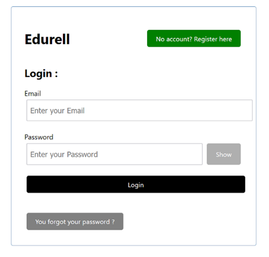

- Once on the Register Page (see photo below) :
  - Enter your email address to create the account and login in the future. The email address must be valid.
  - Enter your name and surname, they are required for the creation of the account
  - Enter a password and confirm it (both fields must contain the same password)
  - Click on “Register” to go to the validation page
  - **Important :** All fields are compulsory. If one field remains empty, an alert will show up to warn the user. The next step is accessible only if all the fields are filled.

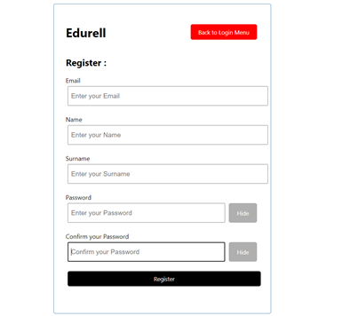

- When all the fields are filled click on “Register”, you will be redirected to the validation page for registration

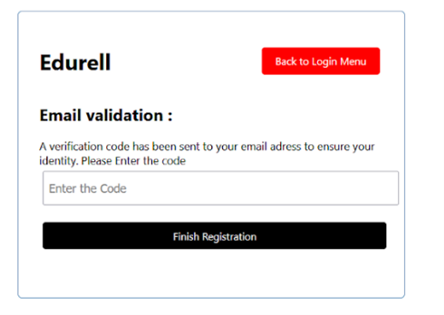

- Enter the validation code received on the email address indicated as the address associated to the new account
- Click on “Finish registration” to finish the registration of the new account

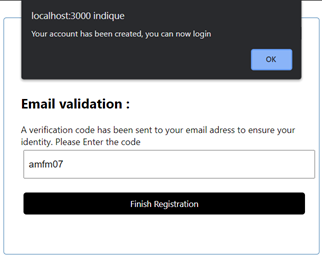

- When you enter the right code, the account is created
- An alert will show up
- Click on “OK”, you will be redirected to the login page

### One field is empty

- If one field is empty when you click on “Register”, an alert will warn you that something is missing

### Password confirmation does not match the password

### Invalid email address
- If the email address is invalid, the confirmation code can’t be sent so an alert will appear

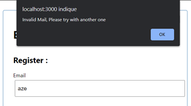

### Wrong confirmation code
- If the confirmation code is wrong, an alert will appear and the account won’t be created

## Edition
In this section we test 3 scenarios :

1. We change the name and/or the surname
2. We leave the name and/or the surname empty
3. We try to use more than 20 characters in each field

### Both field specified
- Go to the edit profile page

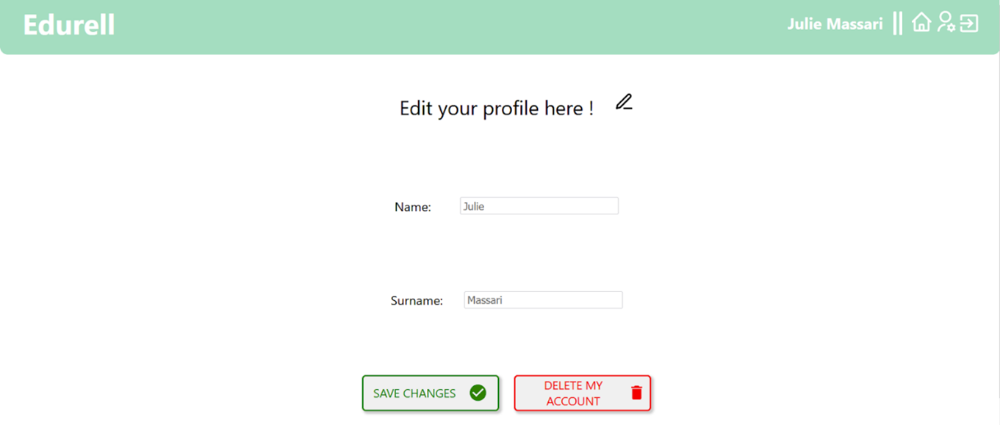

- Click on the pen to switch to edition mode
- A text “You are in edition mode” warns you

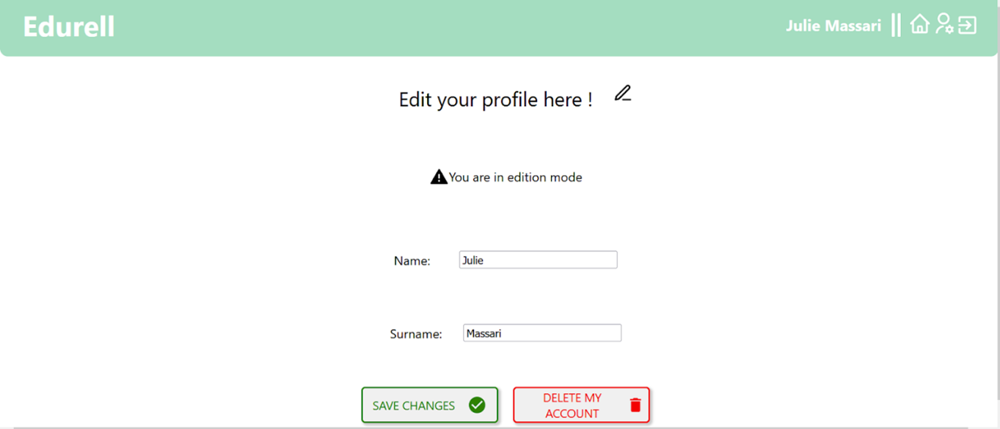

- In the edition mode change your name and/or your surname

- Here we go from “Julie” to “J” and from “Massari” to “M”
- Click on “Save changes” to confirm

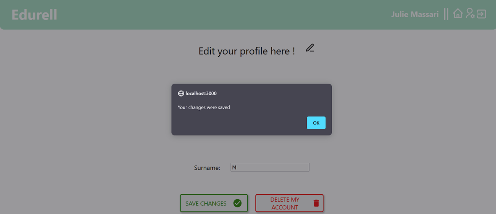

- An alert pops up to confirm the change
- Click on “OK”

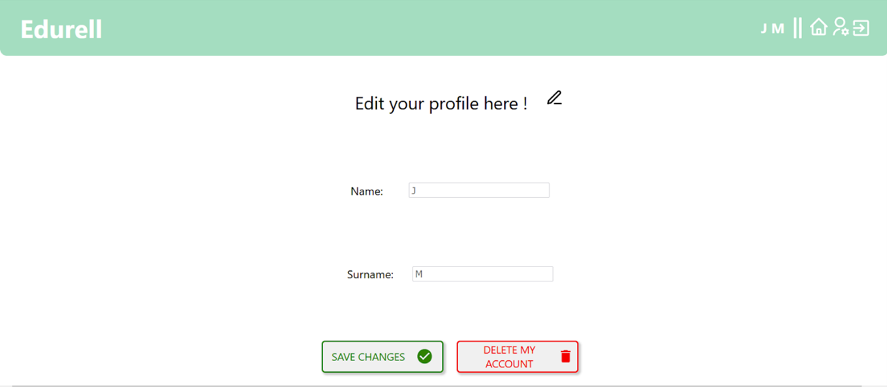

- The change appears on the edit profile page
- Go back to the dashboard

- The change also appears in the header of the dashboard

### One field missing
- Leave the “name” field empty

- The field changes his color and turns to red
- Click on “Save changes”

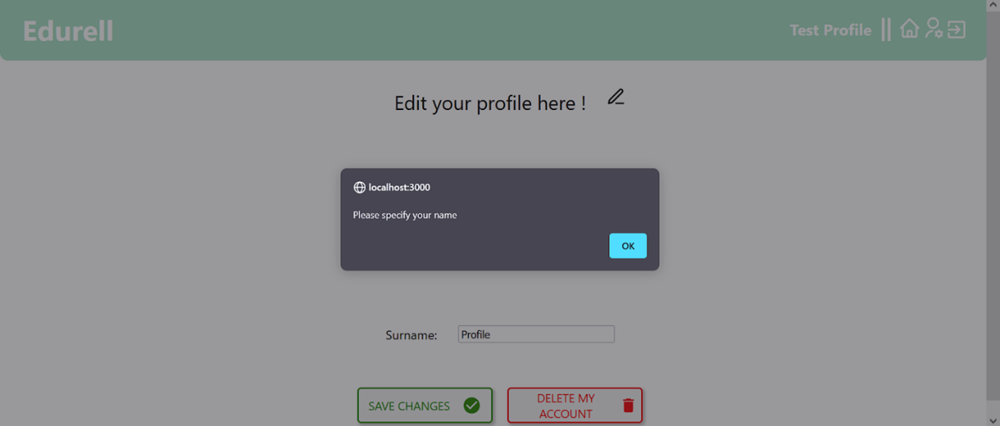

- An alert pops up to ask you to specify the name

- Same for the surname

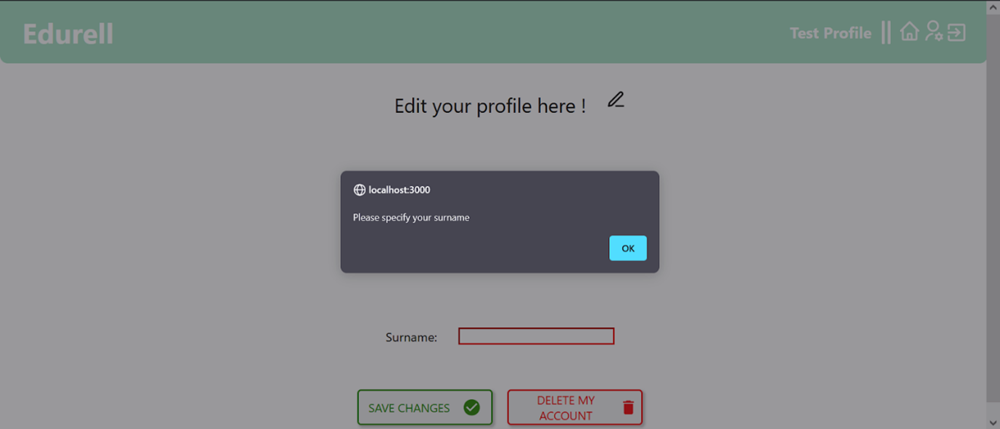

### Input maxLength = 20
We set a maximal length for the name and the surname to 20 characters. Therefore it’s impossible to enter more than the limit of characters. No alert pops up if you try to use more characters, but it will just stop writing at 20 characters.

## Deletion
To delete an account you need the email address associated with the account. As soon as you click on “Delete my account” you will receive an email with a code to confirm your choice. We will test 3 scenarios here:

1. Correct validation code
2. No code entered
3. Wrong validation code

### Correct validation code

- Go to the “Edit profile” page

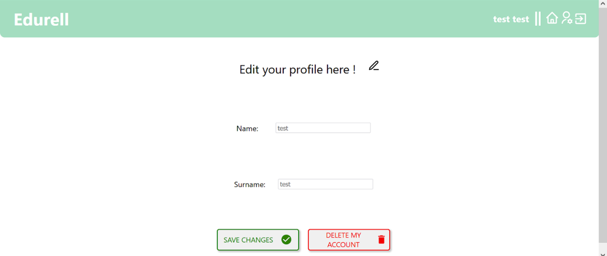

- Click on “Delete my account”
- The button will transform and ask you for a validation code
- You will receive this code by email (on the address used for the account)

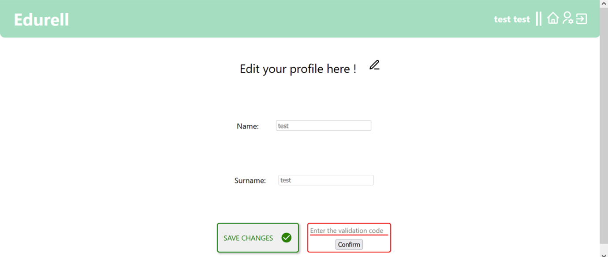

- Enter the validation code in the field
- Click on “Submit”

- An alert pops up to confirm that your account is deleted
- Click on “OK “ and you are back on the welcome page

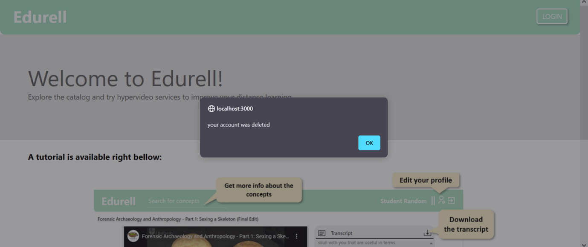

- If you try to login with the account that you just deleted, an alert pops up to show an error in the credentials
- Which is normal because the account no longer exists

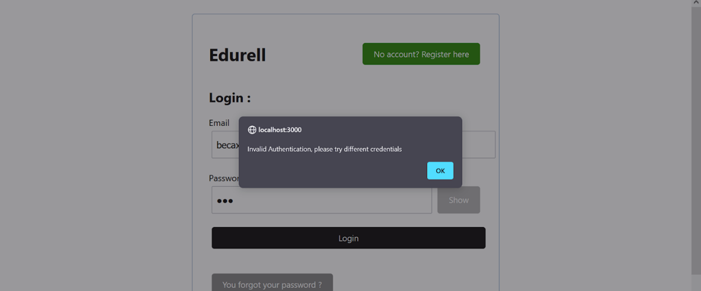

### No validation code entered
- Click on “Delete my account”
- The button will turn into a field to enter the validation code and submit your request

- Do not enter anything
- Submit

- An alert pops up to remind you of entering the code

### Wrong validation code
- On the editing profile page, click on “Delete my account”
- Enter a wrong code for validation
- Submit

- An alert pops up to warn you that the code is wrong

## Login
**Welcome page**

Click on the button “Login”

**Login page**

- Fill in the fields to specify the credentials
- First, the email address associated with the account, then the password (Click on “Show” to see your password while you are typing it.)
- Click on “Login” to access your account. You will be redirected to your dashboard.

# Dashboard
## Catalog exploration 
### Consistent research
- On the dashboard click on the search bar “Browse the catalog”
- Enter a consistent title

- The suggestions appear right below the search bar

### Random research
- On the dashboard, enter a random value in the catalog

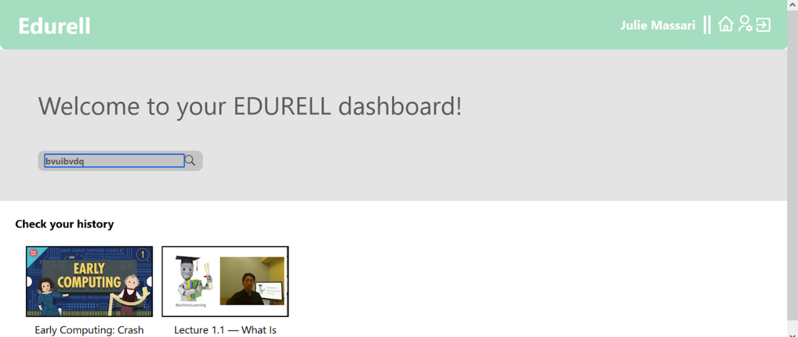

- Nothing is suggested

## History exploration
### No history
- If you have not watched any video yet, you don’t have a history so no video will appear 

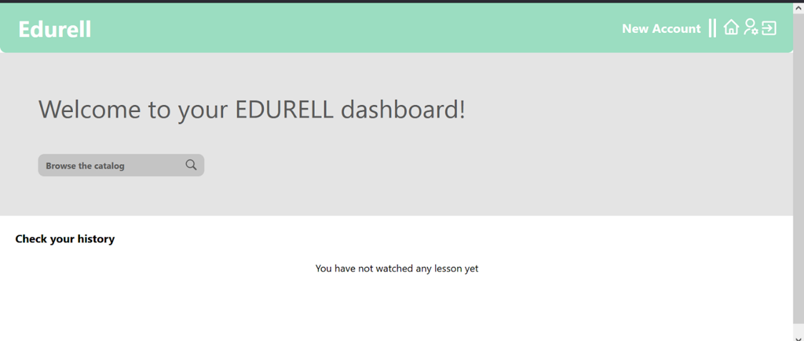

### History registered
- If you have watched videos, they will be stored and appear in a horizontal list
- The last video stored in the history is at the end of the list (on the right)

- For example if you click on the first title of the first video (here: “Forensic…”) you will access the page corresponding to the video, see below:

# Header
The header is a tool to access different features. It is different according to the page where you are :

1. Header on the welcome page 

2. Header on the video page

3. Header on the dashboard and edit profile page
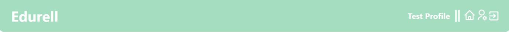

## Links
Here we are interested in the links that the dashboard provides

3 features are
available (from the left to the right):

1. Go back home (to the dashboard)

This home icon redirects you to your dashboard

2. Edit my profile

This settings icon redirects you to the edit profile page (where you can change your name and/or surname and/or delete your account)

3. Logout

This exit account allows you to logout from your account and redirects you to the welcome page

# Video augmentation and knowledge visualisation
## Start at the last timestamp of the video
Once your logged-in, you should see your dashboard with the videos that you already visited:

If you click on a video in your history, you will directly start the video at the timestamp of your last visit (here 3min 09sec)

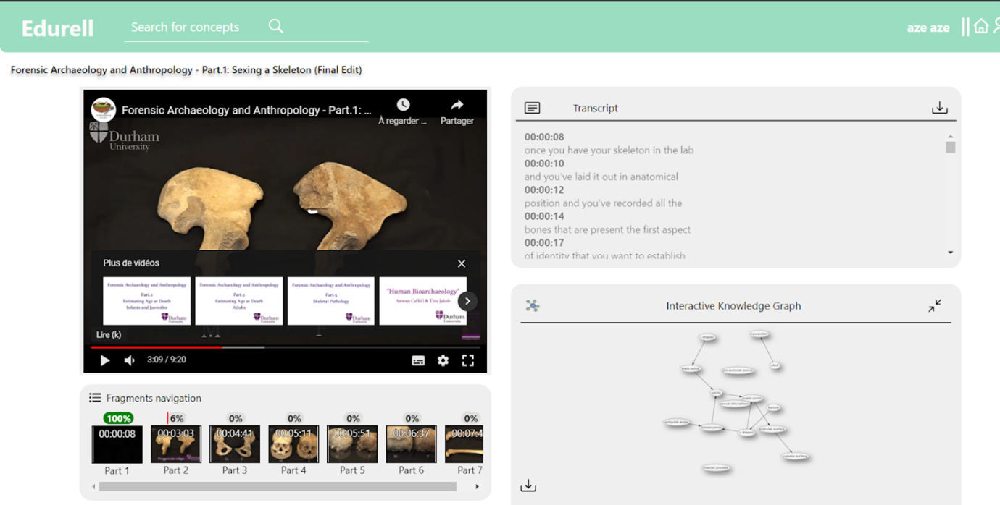

## Fragment navigation

You can navigate to the wanted part of the video by clicking on the image once. You can see with the progress bar over each video fragment if the user has watched it entirely or not. The images correspond to the frame of the video at the starting fragment

## Interactive Knowledge Graph

On the bottom right of the page corresponding to a video, there is an interactive knowledge graph that shows the concepts that are explained in the video and their links. The nodes change their colors according to where you are timewise in the video (grey when the concept will be seen later in the video, red when it’s being explained right now and light red when it’s already have been explained)

### Dots

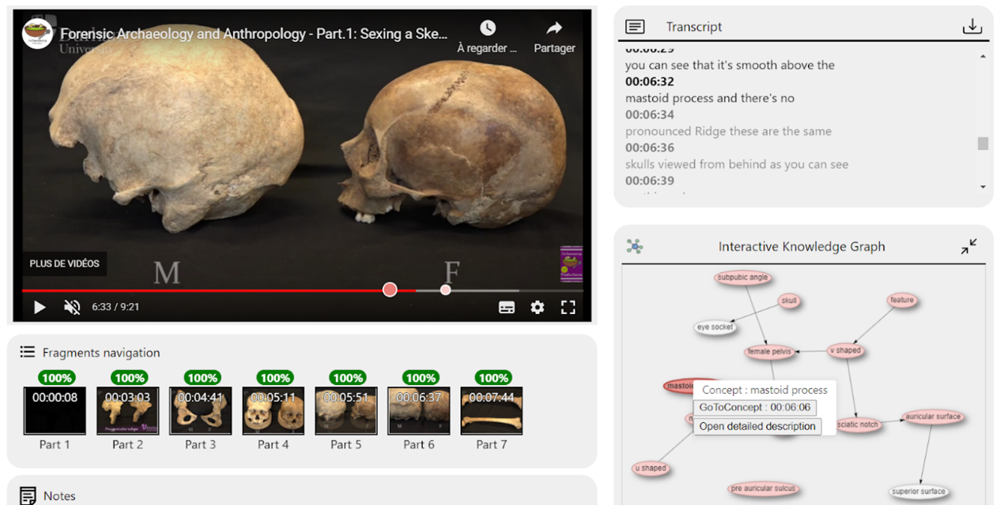

- When you click on a concept node in the graph, you have 2 dots appearing on youtube’s timebar, corresponding to where the concept’s explanation starts and where it ends. The dots disappear if you unfocus the node (click on an empty space in the graph box)

### View more (simple click) and Navigation (simple or double click)

- When you click on a concept node in the graph, a pop up window appear (see previous photo).
- You can go to the part of the video where the concept’s explanation begin by clicking on the “GoToConcept” button. A double-click on the node have the same behavior, you navigate to the timestamp of the video where the concept’s explanation begin.

You can have more details on a concept by clicking the “Open detailed description” button. It will open this window : 

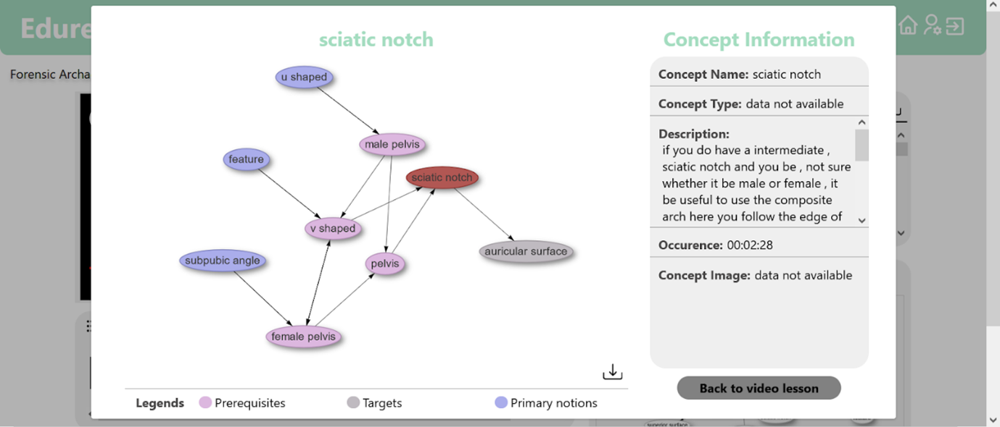

### Download

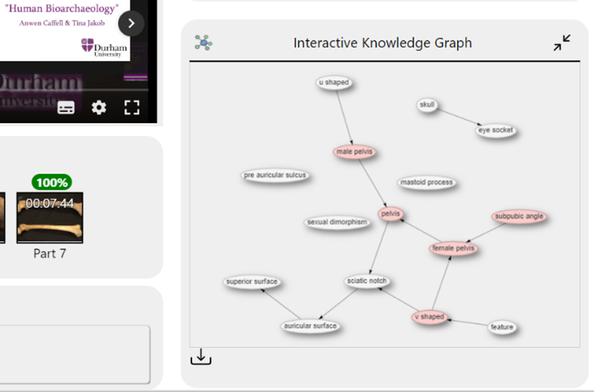

- You can download the graph in a json format by clicking on the Download Icon below the graph on the left

## Transcript
### Synchronization

- On the right of the video, you can find the corresponding transcript to follow the video

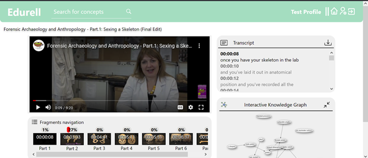

- You can navigate in the video with the transcript
- Click on one element in the transcript to start the video at the timestamp chosen

### Download

- You can also download the transcript in a JSON format
- To do that, click on the icon on the right of the title “Transcript”

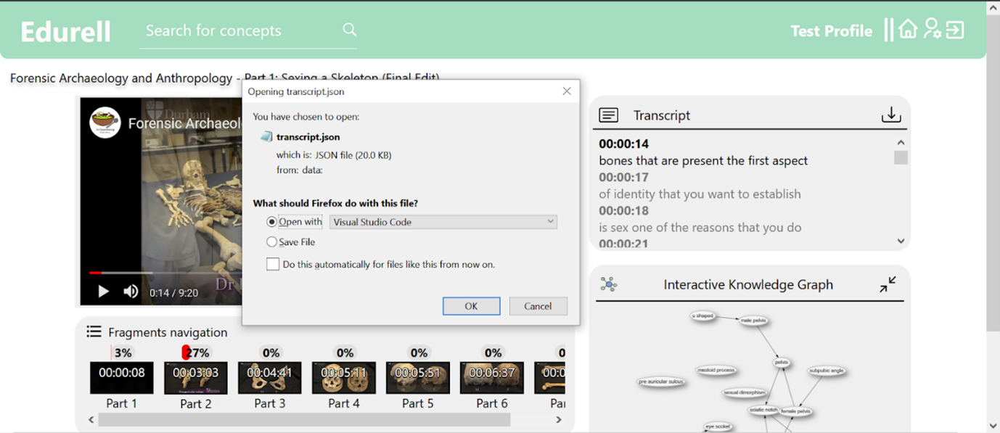

## Notes

- For each video you can take notes and write them down in the box at the bottom of the page.
- Your notes will be saved every 10 sec.

- After watching the video, if you go back to the dashboard and then back again to the video, you will see your latest notes registered.

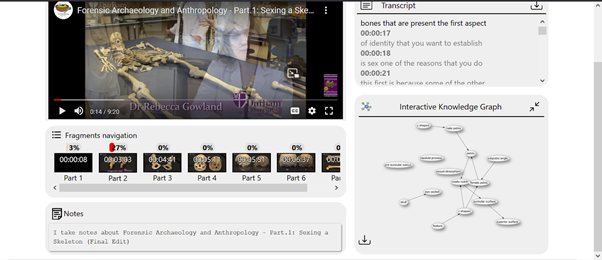

## The search bar to help understand a concept
### Consistent research

- To get more details about a concept introduced in the video you can use the header’s search bar

- Type anything to see the results
- To view more details about a concept click on the concept chosen

- Here we choose “v shaped” and “female pelvis”
- A window looking like a pop up will open

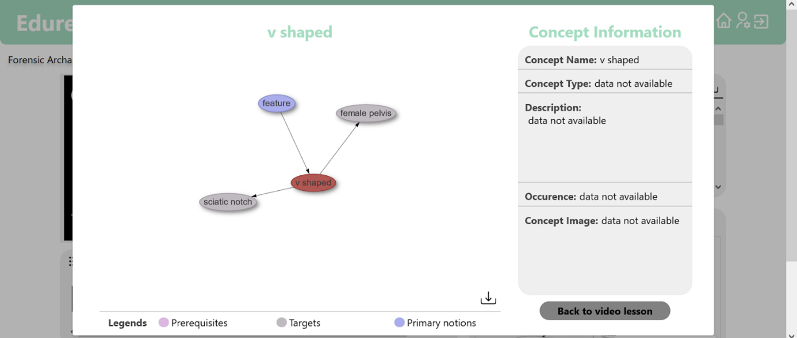

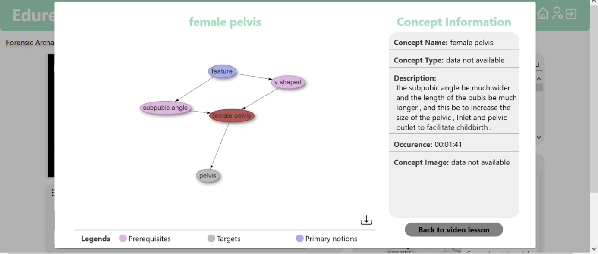

- For each concept we have different information
  - The title at the top of the window
  - The sub-knowledge graph corresponding to the concept
  - The legends on the left to help understand the graph
  - Extra information about the concept
    - The name
    - The type
    - The description
    - The occurrence : when the concept is introduced
    - An image representing the concept
- Not all the information is always present
- If an information is missing, it is specified
- If an information has a big content (ex : the description) the content becomes scrollable (description of female pelvis)
- Above the legends and on the right, an icon allow the user to download the subgraph in a JSON format
- Finally at the bottom right, we have the button to go back to the video and close the window

### Random research

- If you type something not consistent in the search bar you will simply get no result

