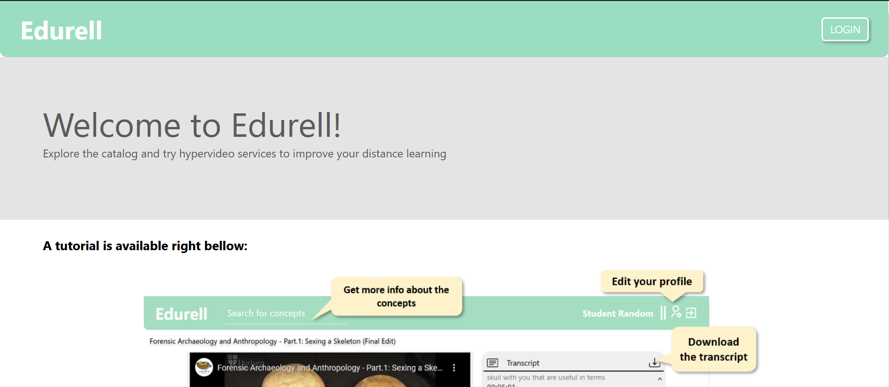
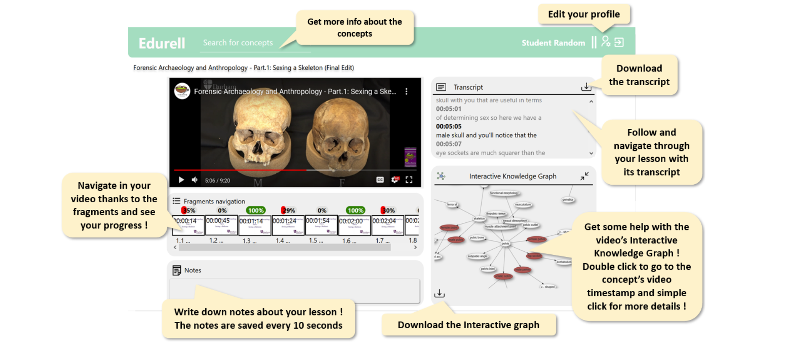
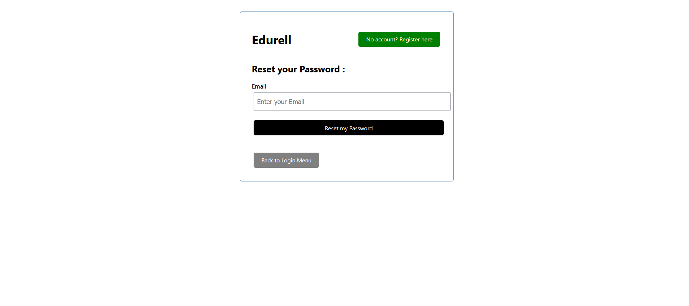
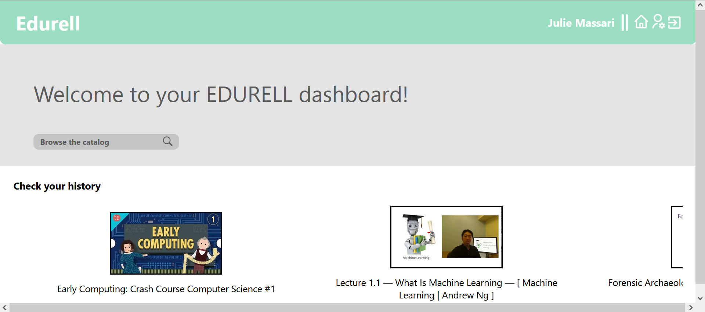
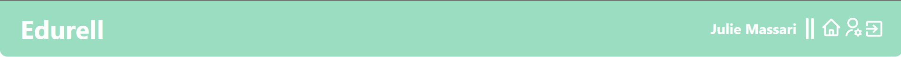
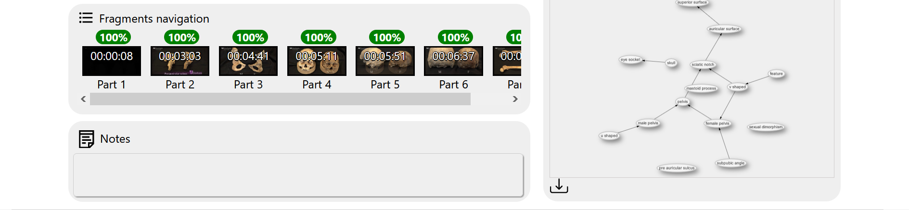
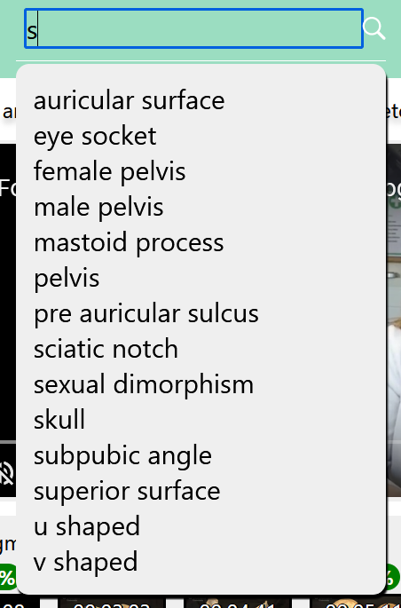
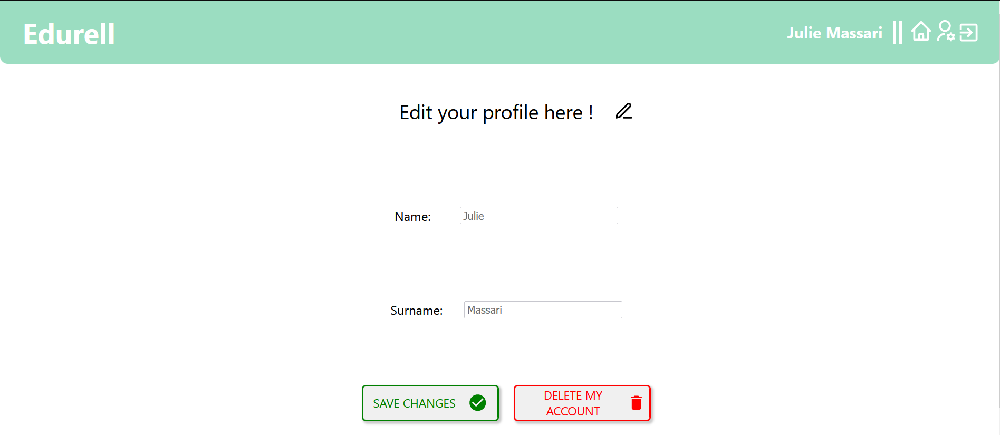
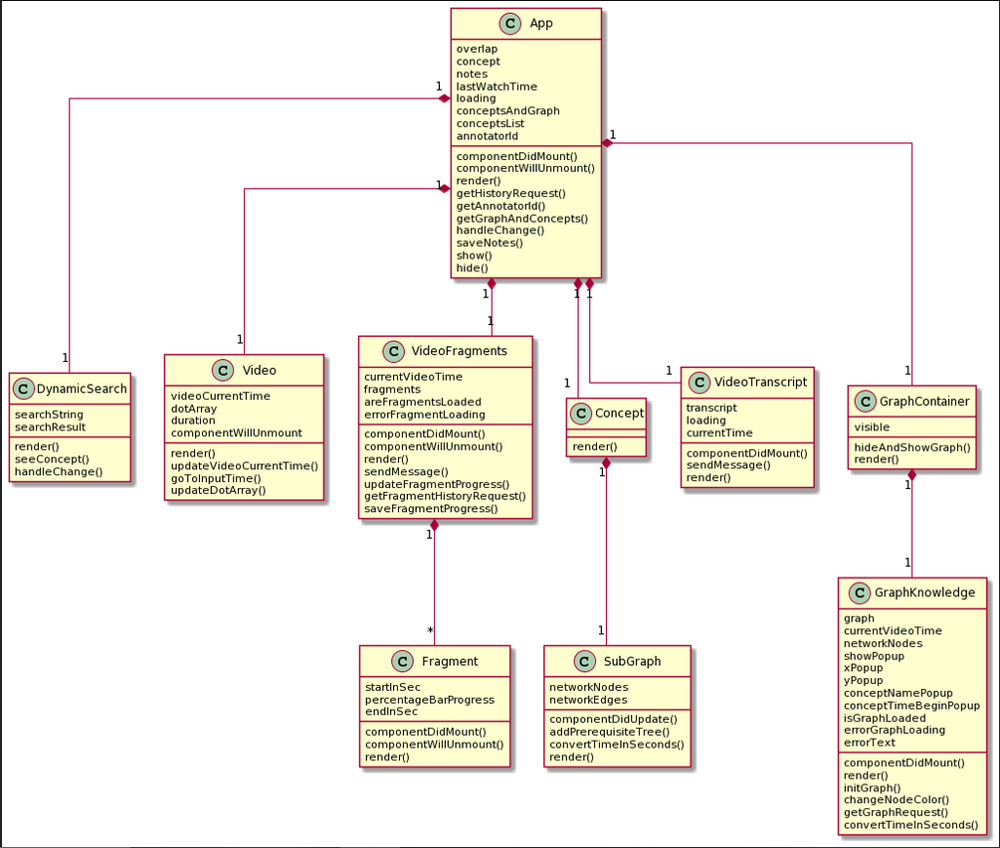
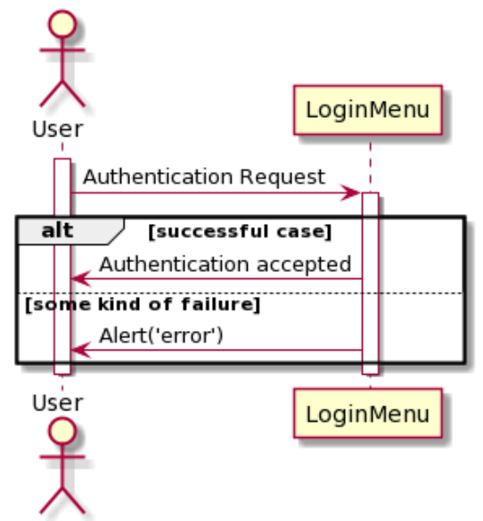

# DRS EDURELL Project

## Design Requirement Specification Document

### DIBRIS – Università di Genova. Scuola Politecnica, Corso di Ingegneria del Software 80154

#### DATE : 06/07/2021

#### VERSION: 0.0.1

#### Autori

MASSARIE Julie

NEVEUX Thomas

**REVISION HISTORY**

| Versione | Data | Autori | Note |
| --- | --- | --- | --- |
| | | |

# Introduction

## Bibliographic references

## Definitions and Acronyms

| **Acronym** | **Definition** |
| --- | --- |
| SE | Software Engineering |
| EDURELL | EduResource knowledge graph extraction and in-context support to learners |
| MOOC | Massive Open Online Course |

## Overview

Come è organizzato il documento

This document's aim is to describe the project&#39;s requirement, objectives and architecture.

# Project Description

## Introduction

The diagrams drawn to describe the system were made with plantuml

## System Architecture

The project is an educative video platform with an enhanced interactive interface to help the student learning process. Our task in this project is to creaté the front-end of the application, the front will communicate with a DBMS (MongoDB) and an API.

The technologies used to create the front-end are flask (python library) and React (JavaScript library).

## Constraints and Assumptions

Content addition : the video are stored on youtube and the additional informations (video fragmentation and conceptualisation) are added to the dbms by another application made specially for the teachers.

Design and layout customisation options : The design of the application is provided by GALLUCCIO Ilenia (client).

Hosting : the website will be hosted on a server from the university of Genova

# Interface

## Welcome page

The Welcome page is the first page that the user sees. There is a welcome message, a tutorial to explain how the main features of the app work, and a login button on the top right.

## Login/Register page

This page allows the user to login if an account is already created or to create one otherwise.

### Login

On this page the user has to specify the email address associated with the account and the password. Then click on "Login". If the user wants to be sure that the password being typed is correct, the button "Show password" can display the password.

### Reset password

On the login page there is a button "Reset password" in case the user forgot the password or wants to change it.

### Register

If the user does not have an account yet it is possible to create one. To do so, some information is required:

* name
* surname
* email address
* password

The password must be specified twice for verification.

### Validation code for registration

Once the user creates a new account, a code is sent on the email address ton confirm the registration.

## Dashboard

The dashboard is the 1st page that the user sees after the login step. There is a catalog to search for videos. Bellow there is the users history: the list of the videos already watched or in progress. To access a video, the user clicks on the title of a video (either in the history or in the catalog if there is a result for the research).

## Header

On the header there is the logo of EDURELL, the user's name and surname, a home icon to go back to the dashboard, a settings icon to edit the user's profile and a logout icon.

## Video

This page is very important and contains several elements described with details bellow. The goal of this page is to follow a lesson through a video, a transcript, an interactive knowledge graph, a fragmentation of the video, the possibility to take notes and a search bar to get more information about the concepts explained in the video.

### Interactive Knowledge Graph

This graph represents the content of the video. More precisely, it shows the concepts discussed in the video and their relations to each other. The graph has several features:

* While the video is playing, the graph dynamicall evolves.
* If a concept is being explained, it will appear red.
* If a concept was explained previously, it will be pink.
* If the user double clicks on a concept, the video will reach the timestamp where the concept is explained.
* If the user clicks once, an overlay will appear and offer different options: go to the concept's timestamp or view more details about the concept (see "Subgraph part later)
* On top right next to the title, the user can hide the graph.
* On the bottom left the user can download the graph in a JSON format

### Transcript

The transcript is litteraly what is being said in the video. The user can then follow the lesson because the transcript and the video are synchronised. On top of that, the user can go to a specific timestamp of the video by clicking on the text chosen. It is also possible to download the transcript in a JSON format on top right.

### Fragments navigation

Some videos can be quite long to wtach. Thereofre, there is a fragmentation of the video so that the user can watch only the parts that he is interested in by clicking on the fragment. The progress is also displayed.

### Notes

For each video the user can take notes. The notes are registered every 10 seconds.

### Search bar

If the user wants to no more about a cocnept, it is possible to look for it in the search bar in the header. It is a normal research and the results are displayed bellow.

### Subgraph and information

If the user chooses to see more information about a concept, a window overlaps the main window. In this interface there is another graph (smaller) focused on the concept and its main relationships with the other concepts. On the right there is detailed information.

## Edit profile

On this page the user can change the name and the surname used and also delete the account. If the user chooses ot delete the account, he will receive a code to confirm his choice.

# Data Stores

# Structural Design

## Class Diagrams

The application is made of a lot of classes so we divided the class diagram in 2 different diagrams.

### Class Description

**Welcome**: displays the main goals of the app and a tutorial.

**LoginMenu**: contains the logic and interface to allow the user to login with an existing account.

**RegisterMenu**: contains the logic and interface to allow the user to create and register an new account.

**LogoutButton**: allows the user to logout from his session.

**Dashboard**: contains the React components to provide the user's history and the list of the available videos.

**App**: contains the React components to allow the user to follow a lesson (video, transcript, knowledge graph, fragments navigation, notes, search bar)

**DynamicSearch**: contains the logic and the interface from the concept search bar

**VideoFragments**: contains the logic and the interface from the slider to navigate between video fragments. The &quot;sendConceptTimestamp&quot; method is sending to the Video component the timer to change the video timecode.

**VideoTranscript**: contains the logic and the interface to display the transcript of the video. The video and te transcript are synchronized.

**Video**: contains the youtube player where the educative video will be played.

**Graph**: contains the interface around the knowledge graph. The &quot;sendConceptTimestamp&quot; method is sending to the Video component the timer to change the video timecode.

**GraphKnowledge**: contains the logic and the interface to display the knowledge graph

**EditProfile**: contains the React components and the logic to allow the user to change the name and/or surname and/or delete the account.

## Object Diagram

# Dynamic Models

## Requisites

### Sequence diagram for the login feature

### Sequence diagramm for the browsing of the catalog on the dashboard

### Sequence diagramm for the navigation in a video through the fragments, graph and transcript

### Sequence diagramm for the research of a concept and download of the subgraph

### Sequence diagramm for the edition and deletion of an account

